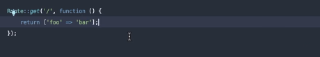
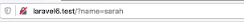
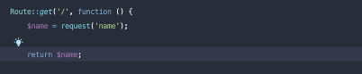
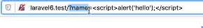
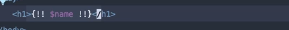
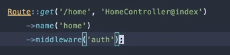

1. Create _New Application_.
   **Application-env**

```bash
npm install
npm start
```

- **npm start** should not use _nodemon_.

### Routes

1. You can return Json object or _HTML_
   

   

1. By using request() you can access params form _URL_.

   

1. User can pass javascript in params, but JS code will not execute if you use {{$var}}

   

1. If you want laravel to not escape
   

### Elequent

### Authentication

1. _composer require laravel/ui_
1. _php artisan help ui_
1. _php artisan ui vue --auth_
1. _npm install && npm run dev_
1. _Auth::route()_ created by upper command "ui --auth"
1. _php artisan route:list_ // will list all routes
1. _php artisan migrate_ after database connection
1. _this->middleware('auth')_ , written in HomeController@\_construct
   

```

```
