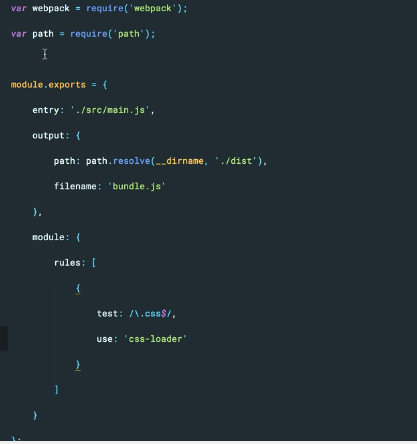

1. install webpack
1. ```bash
   npm install webpack
   ```
1. You installed webpack locally reference _node_modules/.bin/webpack_ if not found webpack
1. _webpack src/main.js dist/bundle.js --watch_ first file in input file and second is output file --watch for continuous conpilation

```bash
"build": "webpack src/main.js dist/bundle.js --watch"
```

1. webpack.config.js file for configuration

```bash
npm install css-loader --save-dev
```

1. Without css-loader you may not be able to compile CSS files.
   

1. This package is must if you want to use style sheets imported by _css-loader_.

```bash
npm install style-loader --save-dev
```
